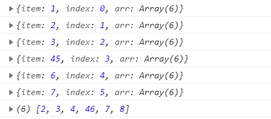

# 数组

> api说明

#### 🤔 _map() 
<strong>语法:</strong> _map(arr, callback(item, index, arr)) <br/>
<strong>功能:</strong> 返回一个由回调函数的返回值组成的新数组
#### 🤔 _reduce() 
<strong>语法:</strong> _reduce(arr, callback(a,b)) <br/>
<strong>功能:</strong>从左到右为每个数组元素执行一次回调函数，并把上次回调函数的返回值放在一个暂存器中传给下次回调函数，并返回最后一次回调函数的返回值
#### 🤔 _filter()
<strong>语法:</strong> _filter(arr, callback(item, index, arr))<br/>
<strong>功能:</strong>将所有在过滤函数中返回 true 的数组元素放进一个新数组中并返回
#### 🤔 _find()
<strong>语法:</strong> _find(arr,value) <br/>
<strong>功能:</strong>找到第一个满足测试函数的元素并返回那个元素的值，如果找不到，则返回 undefined。
#### 🤔 _findIndex()
<strong>语法:</strong> _find(arr, callback(item, index, arr)) <br/>
<strong>功能:</strong>找到第一个满足测试函数的元素并返回那个元素的索引，如果找不到，则返回 -1。
#### 🤔 _every()
<strong>语法:</strong> _every(arr, callback(item, index, arr))<br/>
<strong>功能:</strong>如果数组中的每个元素都满足测试函数，则返回 true，否则返回 false。
#### 🤔 _some() 
<strong>语法:</strong> _some(arr, callback(item, index, ar)) <br/>
<strong>功能:</strong>如果数组中至少有一个元素满足测试函数，则返回 true，否则返回 false。

## 1. _map实现

#### 参数
arr [Array]:需要进行遍历的数组<br/>
callback [Function]: 数组中每个元素需要去执行的回调函数，它可以接收三个参数。

1. item : 数组中每一个元素
2. index : 每个元素索引
3. arr : 当前遍历的数组

<code>返回</code>：返回每个执行回调函数后返回值组成的新数组。

#### 示例

```javascript
let a = [1, 2, 3, 45, 6, 7]
let b = _map(a, (item, index, arr)=>{
    console.log({
        item,
        index,
        arr
    })
    return item + 1
})
console.log(b)
```
#### 结果




#### 代码实现
```javascript
function _map(arr, callback) {
    let result = []
    for (i = 0; i < arr.length; i++) {
        let a = callback(arr[i], i, arr)
        result[i] = a
    }
    return result
}
```

## 2. _reduce实现

#### 参数
arr [Array]:需要进行遍历的数组<br/>
callback [Function]:数组中每一个元素都需要执行的回调函数,它接收两个参数
1. result :上一个回掉执行返回的结果
2. value: 当前遍历的元素

initValue [*]: 设置第一个回掉函数返回结果。

<code>返回</code>：返回最后一次回掉函数执行的结果

#### 示例

```javascript
let arr = [1, 2, 45, 56, 6]
let b = _reduce(arr, (a, b) => {
    return a + b
}, 0)
console.log(b)
```
> 结果：330


#### 代码实现
```javascript
function _reduce(arr, callback, iniValue = null) {
    let a = initValue
    for (i = 0; i < arr.length; i++) {
        let b = callback(result, arr[i])
        a += b
    }
    return a
}
```

## 3. _filter实现

#### 参数
arr [Array]: 需要执行回掉函数进行遍历的数组
callback [Function]: 数组中每个元素都需要执行的回掉函数，它可以接收三个参数。

1. item : 数组中每一个元素
2. index : 每个元素索引
3. arr : 当前遍历的数组

<code>返回</code>：返回每个执行回调函数后返回值为<code>true</code>的数组值组成的新数组。

#### 示例

```javascript
let arr = [1, 2, 45, 56, 6]
let b = _filter(arr, (item, index, arr) => {
    return item > 45
})
console.log(b)
```

>结果：[56]

#### 代码实现
```javascript
function _filter(arr, callback) {
    let result = []
    for (i = 0; i < arr.length; i++) {
        if(callback(arr[i], i, arr)){
            result.push(arr[i])
        }
    }
    return result
}
```

## 4._find实现

#### 参数
arr [Array]: 需要进行查找的数组<br/>
callback [Function]: 对数组进行测试，找到满足条件的值的判断函数，它可以接收三个参数。

1. item : 数组中每一个元素
2. index : 每个元素索引
3. arr : 当前遍历的数组

<code>返回</code>:返回第一个满足测试函数条件的数组值，找不到返回undefined

#### 示例

```javascript
let arr = [1, 2, 45, 56, 6]
    let b = _find(arr, (item, index, arr) => {
        return item >= 2
    })
console.log(b)
```

>结果：2

#### 代码实现
```javascript
function _find(arr, callback) {
    for (i = 0; i < arr.length; i++) {
        if(callback(arr[i], i, arr)){
            return arr[i]
        }
    }
    return undefined
}
```

## 5._findIndex实现

#### 参数
arr [Array]: 需要进行查找的数组<br/>
callback [Function]: 对数组进行测试，找到满足条件的值的判断函数，它可以接收三个参数。

1. item : 数组中每一个元素
2. index : 每个元素索引
3. arr : 当前遍历的数组

<code>返回</code>:返回第一个满足测试函数条件的数组值的索引，找不到返回-1


#### 示例

```javascript
let arr = [1, 2, 45, 56, 6]
let b = _find(arr, (item, index, arr) => {
        return item >= 2
    })
console.log(b)
```

>结果：1

#### 代码实现

```javascript
function _findIndex(arr, callback) {
    for (i = 0; i < arr.length; i++) {
        if(callback(arr[i], i, arr)){
            return i
        }
    }
    return -1
}
```


## 6._every实现

#### 参数

arr [Array]: 需要进行遍历的数组<br/>
callback [Function]: 对数组进行测试，进行条件的判断函数，它可以接收三个参数。

1. item : 数组中每一个元素
2. index : 每个元素索引
3. arr : 当前遍历的数组

<code>返回</code>:返回Boolean值,只有数组所有元素执行回掉函数返回true才最终返回true,否则返回false.

#### 示例

```javascript
let arr = [1, 2, 45, 56, 6]
    let b = _every(arr, (item, index, arr) => {
        return item > 10
    })
    console.log(b)
```

>结果： false

#### 代码实现

```javascript
function _every(arr, callback) {
    let count = 0
    for (i = 0; i < arr.length; i++) {
        if(callback(arr[i], i, arr)){
            count ++
        }
    }
    if(count == arr.length) {
        return true
    }
    return false
}
```

## 7._some实现

#### 参数


arr [Array]: 需要进行遍历的数组<br/>
callback [Function]: 对数组进行测试，进行条件的判断函数，它可以接收三个参数。

1. item : 数组中每一个元素
2. index : 每个元素索引
3. arr : 当前遍历的数组

<code>返回</code>:返回Boolean值,至少数组有一个元素执行回掉函数返回true就返回true,否则返回false.


#### 示例

```javascript
let arr = [1, 2, 45, 56, 6]
    let b = _some(arr, (item, index, arr) => {
        return item < 0
    })
    console.log(b)
```

>结果： false

#### 代码实现

```javascript
function _some(arr, callback) {
    for (i = 0; i < arr.length; i++) {
        if(callback(arr[i], i, arr)){
            return true
        }
    }
    return false
}