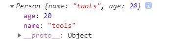

# 自定义new

<code>myNew(fn,...args)</code>

> new 函数：实例化构造函数，然后将新创建对象的原型指向构造函数，双重指引。

<code>ES6中new基本使用</code>

```javascript
function Person(name, age) {
        this.name = name;
        this.age = age
    }
const p = new Person('tools', 20)
console.log(p)
```



#### 参数

<code>fn [Function]</code>: 需要实例化的构造函数<br/>
<code>...args [*]</code>: 任意数据类型，这是你传递给构造函数的参数

<code>返回值</code>：返回一个新的构造函数实例化对象

#### 代码实现

```javascript
function newInstance (Fn, ...args) {
  // 创建一个空的object实例对象obj, 作为Fn的实例对象
  const obj = {}
  // 将Fn的prototype属性值赋值给obj的__proto__属性值
  obj.__proto__ = Fn.prototype
  // 调用Fn, 指定this为obj, 参数为args列表
  const result = Fn.call(obj, ...args)
  // 如果Fn返回的是一个对象类型, 那返回的就不再是obj, 而是Fn返回的对象
  // 否则返回obj
  return result instanceof Object ? result : obj
}
```

#### 测试
```javascript
function Person(name, age) {
    this.name = name
    this.age = age
    // return {}
    // return []
    // return function (){}
    // return 1
    // return undefined
}
const p = new Person('tom', 12)
console.log(p)
const p2 = aUtils.newInstance(Person, 'Jack', 13)
console.log(p2, p2.constructor)
```